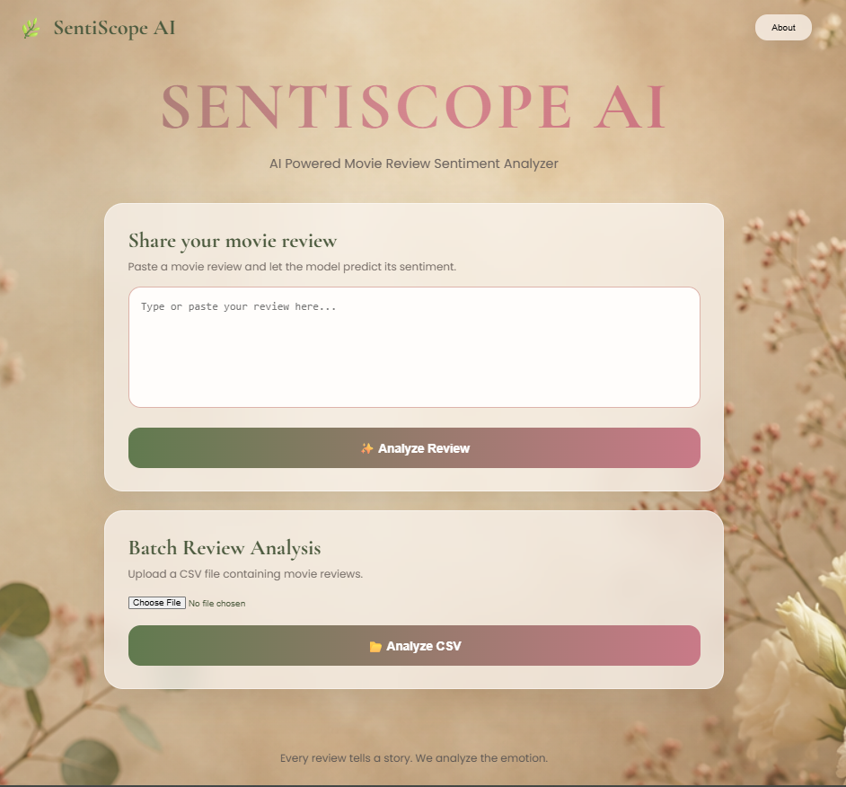
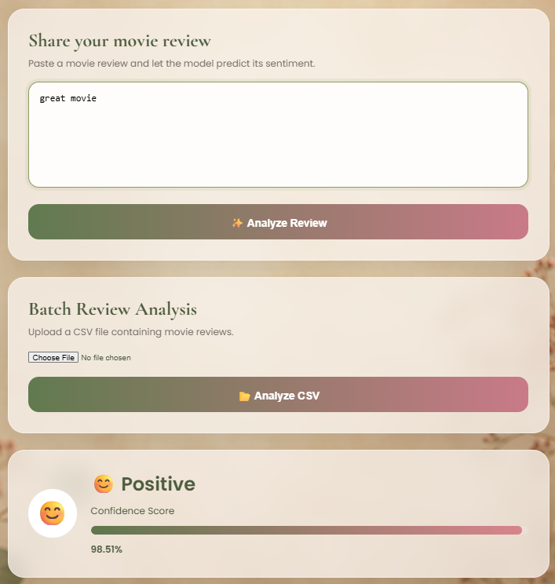
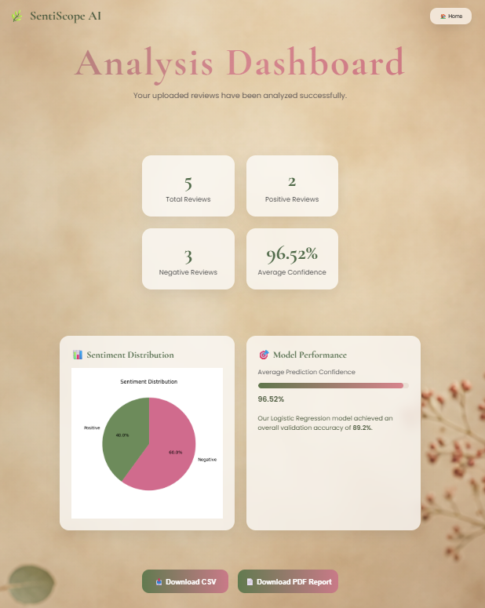

<div align="center">

# 🌿 SentiScope AI

### AI-Powered Movie Review Sentiment Analysis Platform

Automatically classify movie reviews as **Positive** or **Negative** using Machine Learning with confidence scores, interactive analytics, batch CSV processing, and downloadable PDF reports.

🌐 **Live Demo:** https://drishu.pythonanywhere.com/

📂 **GitHub Repository:** https://github.com/drishitapaul/SentiScope-AI

<br>


</div>

---

# 🎯 Business Problem

Can we automatically determine whether a movie review expresses **positive** or **negative** sentiment accurately enough to support real-world applications?

With thousands of user reviews generated every day, manually reading and categorizing feedback becomes slow, expensive, and difficult to scale. An automated sentiment analysis system can help organizations understand audience opinions, flag negative reviews for follow-up, and track sentiment trends over time without reading every review individually.

**SentiScope AI** addresses this challenge using an explainable Machine Learning pipeline that combines **TF-IDF Vectorization** with **Logistic Regression**, delivering fast, accurate, and interpretable predictions through an interactive web application.

# 📸 Application Preview

Experience the complete workflow of **SentiScope AI** — from analyzing a single movie review to generating insights from an entire dataset.

---

## 🏠 Home Page

A clean and intuitive interface where users can either analyze a single movie review or upload a CSV file for bulk sentiment analysis.



---

## 💬 Single Review Prediction

Users can instantly classify an individual movie review as **Positive** or **Negative**, along with the model's confidence score.



---

## 📊 Batch Analytics Dashboard

After uploading a CSV file, the application generates an interactive analytics dashboard featuring:

- 📈 Sentiment distribution
- 📋 Summary statistics
- 📄 Downloadable PDF report
- 📥 Exportable analyzed CSV



# 📊 Dataset

The model was trained using the **IMDb Movie Reviews Dataset**, one of the most widely used benchmark datasets for binary sentiment classification.

| Property | Value |
|-----------|------:|
| Total Reviews | 50,000 |
| Positive Reviews | 25,000 |
| Negative Reviews | 25,000 |
| Distribution | Perfectly Balanced |

Rather than being a limitation, using a benchmark dataset makes the project **more meaningful** because the results can be directly compared with established sentiment analysis baselines published in research.

---

# 🧹 Data Cleaning

Before training the model, the dataset was cleaned to remove unnecessary noise while preserving the sentiment information.

| Issue | Rows Affected | Action Taken |
|--------|--------------:|-------------|
| Duplicate Reviews | 418 | Removed |
| HTML Tags (`<br />`) | Most Reviews | Stripped |
| Numbers & Punctuation | All Reviews | Removed |
| Letter Case | All Reviews | Converted to lowercase |

### Final Dataset

- ✅ **49,582** clean movie reviews
- 😊 **24,884 Positive**
- 😠 **24,698 Negative**

---

# 🤖 Machine Learning Model

### Model Pipeline

```
Movie Review
      │
      ▼
Data Cleaning
      │
      ▼
TF-IDF Vectorization
      │
      ▼
Logistic Regression
      │
      ▼
Prediction + Confidence Score
```

---

### Why TF-IDF + Logistic Regression?

Instead of using a computationally expensive deep learning model, **Logistic Regression** was intentionally selected because it provides an excellent balance between **accuracy, speed, interpretability, and deployment simplicity**.

The workflow consists of two stages:

### 🔹 TF-IDF Vectorizer

Each movie review is transformed into a numerical feature vector by assigning higher importance to informative words while reducing the influence of commonly occurring words. The vectorizer also captures **bi-grams (two-word phrases)** to better preserve context.

### 🔹 Logistic Regression

The transformed features are then classified into **Positive** or **Negative** sentiment using Logistic Regression.

This model was chosen because it:

- ⚡ Trains within seconds
- 📈 Achieves strong classification accuracy
- 🧠 Produces explainable predictions
- 🚀 Is lightweight enough for real-time deployment
- 🔍 Allows interpretation of feature importance

This makes the model significantly easier to understand and deploy than many deep learning alternatives while still delivering competitive performance on this benchmark dataset.

# 📈 Model Performance

The model was evaluated on a **held-out test set of 9,917 reviews**, ensuring that performance metrics were measured on data never seen during training.

| Metric | Score |
|----------|------:|
| 🎯 Accuracy | **89.2%** |
| 🎯 Precision | **88.2%** |
| 🎯 Recall | **90.6%** |
| 🎯 F1 Score | **89.4%** |

The results demonstrate that the classifier generalizes well while maintaining a balanced trade-off between **precision** and **recall**, making it suitable for real-world sentiment analysis tasks.

---

## 📊 Performance Visualizations

### Model Evaluation Metrics


---

### Confusion Matrix

The confusion matrix shows how the model performs across both sentiment classes.


---

# 🧠 Model Interpretation

One of the biggest advantages of using **Logistic Regression** is that the predictions are **interpretable**.

Instead of behaving like a black box, the model allows us to inspect which words contributed most strongly toward each sentiment class.

This provides confidence that the classifier has learned meaningful linguistic patterns rather than memorizing the training data.

### 😊 Strongest Positive Indicators

| Word | Influence |
|------|----------:|
| Great | +7.220 |
| Excellent | +6.700 |
| Best | +5.460 |
| Perfect | +5.411 |
| Amazing | +5.221 |
| Wonderful | +5.068 |
| Favorite | +4.552 |
| Brilliant | +4.533 |
| Loved | +4.342 |
| Enjoyable | +3.986 |

---

### 😠 Strongest Negative Indicators

| Word | Influence |
|------|----------:|
| Worst | -9.608 |
| Awful | -7.875 |
| Bad | -7.411 |
| Boring | -6.665 |
| Waste | -6.653 |
| Poor | -6.099 |
| Terrible | -5.715 |
| Horrible | -5.159 |
| Worse | -5.104 |
| Disappointing | -4.420 |

---

### Feature Importance Visualization


---

## 💡 Key Takeaway

Rather than relying on obscure internal representations, the model learned intuitive sentiment-bearing words that closely match human judgment.

This interpretability is one of the key reasons Logistic Regression was selected for this project—it delivers strong predictive performance while remaining transparent and easy to explain.
# ✨ Key Features

- 🎬 Single Review Sentiment Prediction
- 📂 Batch CSV Sentiment Analysis
- 📊 Interactive Analytics Dashboard
- 📄 PDF Report Generation
- 📥 Downloadable CSV Results
- 🎯 Confidence Score Prediction
- 🌐 Live Web Application

---

# 🛠️ Tech Stack

| Category | Technologies |
|-----------|--------------|
| Frontend | HTML • CSS • JavaScript |
| Backend | Flask |
| Machine Learning | Scikit-learn • Logistic Regression |
| NLP | TF-IDF Vectorizer |
| Data Processing | Pandas • NumPy |
| Visualization | Matplotlib |
| Reports | ReportLab |
| Deployment | PythonAnywhere |

---

# 📂 Project Structure

```
SentiScope-AI
│
├── app.py
├── model/
├── templates/
├── static/
├── screenshots/
├── charts/
├── data/
├── requirements.txt
└── README.md
```

# 🌱 Future Improvements

- 🤖 Transformer-based models (BERT/RoBERTa)
- 🌍 Multi-language sentiment analysis
- 📈 Interactive Plotly dashboards
- ☁️ Cloud deployment with CI/CD
- 👤 User authentication

---

# 👩‍💻 Author

**Drishita Paul**

Electronics & Computer Science Undergraduate

Full Stack Development • AI/ML • Cloud Computing

📧 **Email:** drishitapaul.0605@gmail.com

💼 **LinkedIn:** https://linkedin.com/in/drishita-paul-603b54278

💻 **GitHub:** https://github.com/drishitapaul

---

<div align="center">

⭐ If you found this project interesting, consider giving it a star!

Made with ❤️ by Drishita Paul

</div>