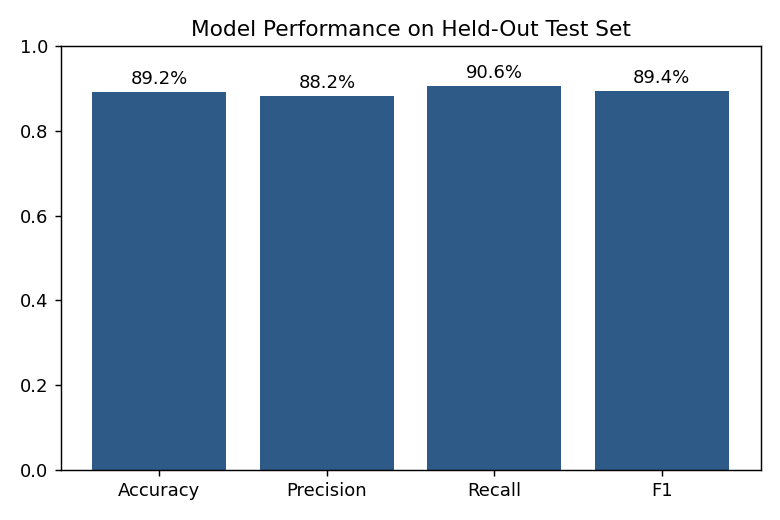
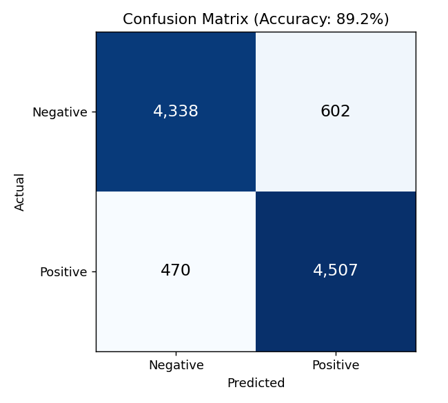
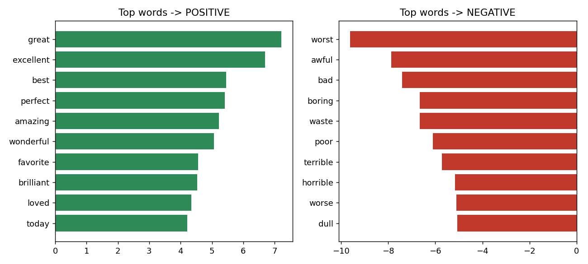

# Movie Review Sentiment Classifier

**Business question:** Can we automatically tell whether a review is
positive or negative, accurately enough to be useful — e.g. flagging
negative reviews for follow-up, or tracking sentiment trends over time
without reading every review by hand?

## Data

50,000 IMDB movie reviews, labeled positive/negative, perfectly balanced
(25,000 each). This is a standard benchmark dataset for text classification
(originally compiled by Maas et al. for exactly this task), which is a
plus, not a minus — it means the results here are comparable to a known
baseline rather than an unverifiable one-off number.

## Cleaning (`01_data_cleaning.py`)

| Issue | Rows affected | Action |
|---|---|---|
| Duplicate reviews | 418 | Dropped |
| HTML tags in text (`<br />`) | most rows | Stripped |
| Punctuation/numbers | all rows | Removed, lowercased |

**Result:** 49,582 clean reviews, still balanced (24,884 positive / 24,698
negative).

## Model (`02_train_model.py`)

**Approach:** TF-IDF vectorization (converts each review into a vector of
word-importance scores, including 2-word phrases) + Logistic Regression.

Chosen deliberately over a neural network: it trains in seconds, the
results are directly explainable (you can see exactly which words drove
each prediction), and it performs strongly on this task — the accuracy
gap to a much heavier model is small, but the "can you explain what your
model is doing" gap is not.

**Split:** 80% train (39,665 reviews) / 20% test (9,917 reviews), stratified
to keep the class balance identical in both.

### Results on the held-out test set

| Metric | Score |
|---|---|
| Accuracy | 89.2% |
| Precision | 88.2% |
| Recall | 90.6% |
| F1 Score | 89.4% |




### What the model actually learned

The words it weighted most heavily match human intuition exactly, which is
a good sanity check that it's learning the right signal, not noise:



Top push toward **positive**: great, excellent, best, perfect, amazing,
wonderful.
Top push toward **negative**: worst, awful, bad, boring, waste, poor.

## Try it yourself (`03_predict.py`)

```bash
python 03_predict.py "This movie was absolutely fantastic, I loved every minute of it!"
# -> POSITIVE (confidence: 91.3%)

python 03_predict.py "Waste of two hours. Terrible acting and a boring plot."
# -> NEGATIVE (confidence: 100.0%)
```

Run with no arguments to see it evaluated against 4 built-in example
sentences, including an ambiguous one ("it was okay, not great but not
terrible either") to show how it handles borderline cases.

## Tools
Python, pandas, scikit-learn (TF-IDF, Logistic Regression), matplotlib.

## Repo structure
```
data/               raw + cleaned data, metrics, top-words CSVs
model/              saved model + vectorizer (.pkl)
charts/             generated PNGs referenced above
01_data_cleaning.py
02_train_model.py
03_predict.py
04_visualizations.py
README.md
```

## Reproduce
```bash
pip install pandas scikit-learn matplotlib joblib
python 01_data_cleaning.py
python 02_train_model.py
python 04_visualizations.py
python 03_predict.py   # try your own text
```
